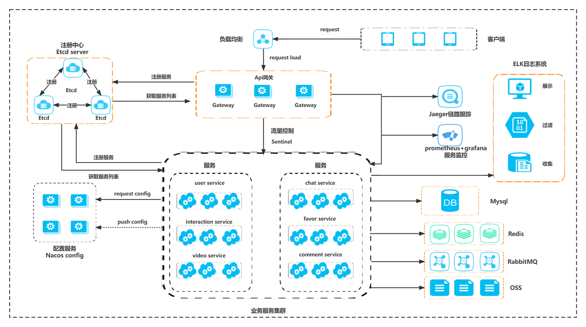

# toktik
## 项目介绍
- 基于 Hertz + Kitex + Gorm 的微服务架构的精简抖音后端。
- 项目服务地址：http://120.78.138.217:8080/ping
- 项目文档地址：https://swuqw5z89yq.feishu.cn/docx/U2LxdtEoNo77K3xlammcTZO5nDe
- 项目地址：https://github.com/Happy-Why/toktik
- Apifox文档地址：https://qn6pcbbdek.apifox.cn/

***

## 快速启动
   -  确保机器已经安装go1.19环境
   -  确保机器已经安装docker和docker-compose
   -  执行 chmod 777 start.sh
   -  执行 sh start.sh
   -  确保以上操作无误后，执行 docker-compose up -d
   -  进入每个toktik服务中，修改config目录下的配置文件
   -  前往nacos配置中心, 地址：http://xxx:8848/
   -  如此配置 
   -  修改好配置后，回到代码目录下，执行 docker-compose up -d
    
***
## 项目架构：

***
## 奖项：

